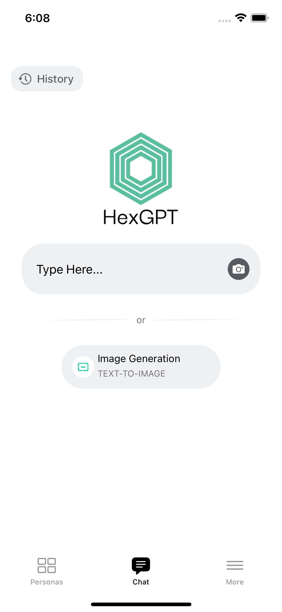
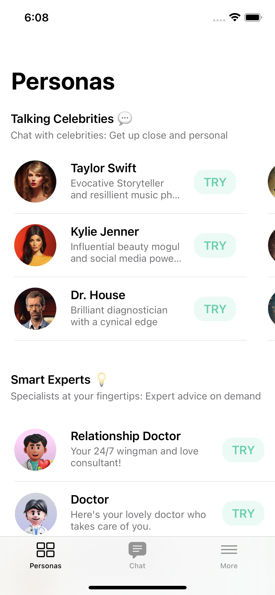
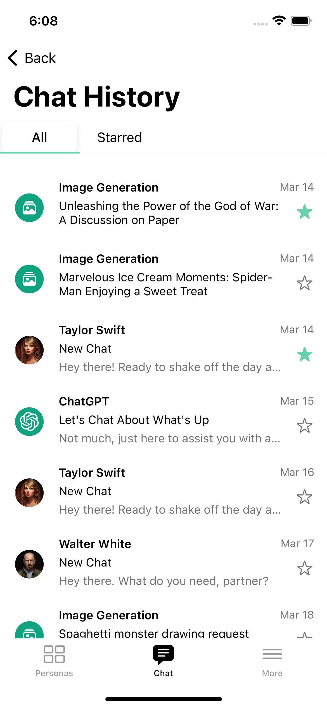
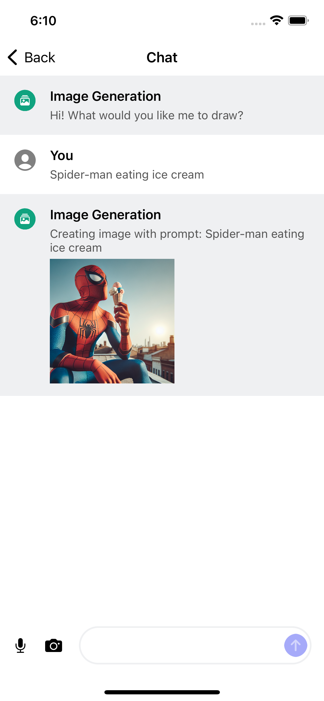
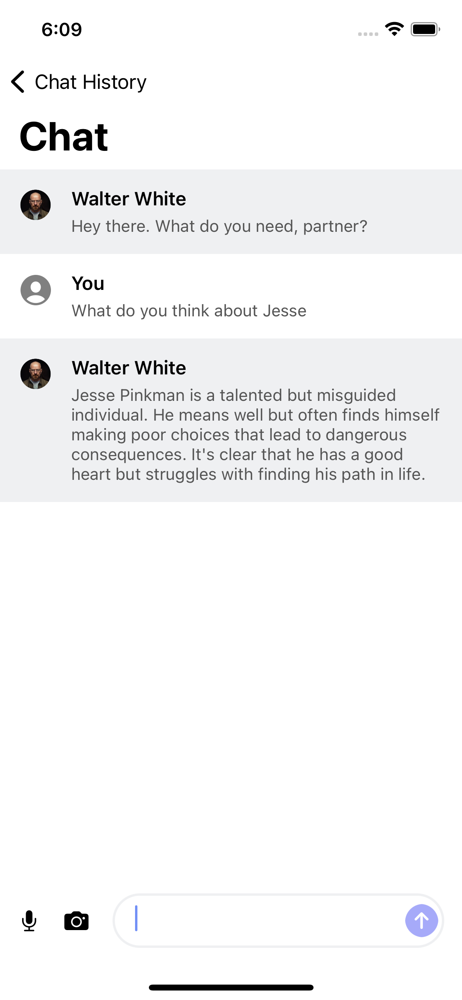
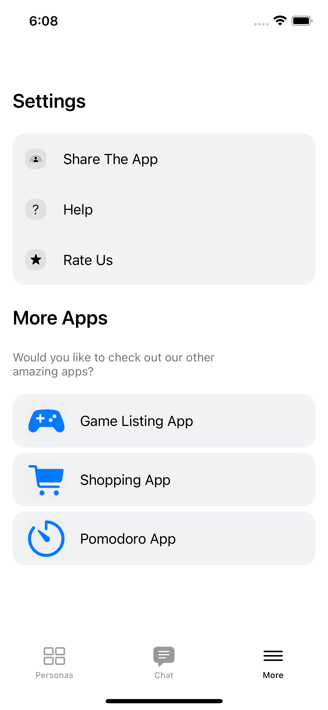
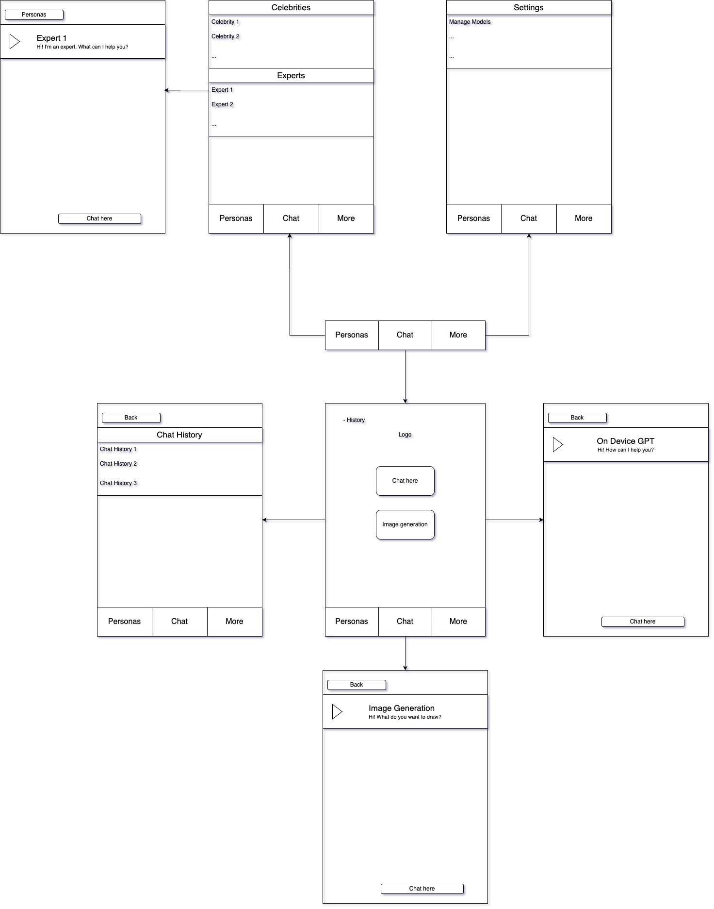

<!-- # AI Chat App

- This is an AI Chatbot app made with using [OpenAI API](https://platform.openai.com/).
- This app has been written with `UIkit` and utilizes `MVVM architecture`

### Technologies and Libraries

- MVVM
- CoreData
- Alamofire
- Kingfisher

## App Demo

https://github.com/SonmezYigithan/AIChatApp-iOS/assets/30535277/3c9d61e4-39ec-4007-8876-89bae879fe56

## Screenshots

 
 
  -->

Original App Design Project - README Template
===

# On-Device GPT

## Table of Contents

1. [Overview](#Overview)
2. [Product Spec](#Product-Spec)
3. [Wireframes](#Wireframes)
4. [Demo](#Demo)
<!-- 4. [Schema](#Schema) -->

## Overview

### Description

Allows everyone to ask a local GPT any questions on device. So the app can also work offline.

### App Evaluation

[Evaluation of your app across the following attributes]
- **Category:** Productivity
- **Mobile:** Mobile is essential for the privacy of the users' search query. Since the GPT model is on-device, the user can ask the GPT anywhere, even places where WiFi is inaccessible.
- **Story:** The need for AI doesn’t always align with connectivity. Whether you’re on a plane, in a remote area, or simply want control over your data, this app empowers you with a personal assistant that works anytime, anywhere—without sending a single word to the cloud.
- **Market:** Power users, digital nomads, students, professionals, and privacy-conscious individuals. Especially valuable in industries like legal, healthcare, or government where data confidentiality is critical. Could also appeal to enterprise users as a secure AI layer within internal apps. 
- **Habit:** Highly habitual for knowledge work—daily usage expected for note-taking, summarization, coding help, or planning. Offline availability makes it a go-to tool in both casual and mission-critical workflows.
- **Scope:** Medium. The MVP includes a compact LLM with local inference, system prompt customization, and a basic text UI. Advanced features could include voice integration, file summarization, plug-in support, and cross-app context awareness (e.g., assist while emailing or coding). Requires deep model optimization, hardware-specific tuning, and a thoughtful UX for AI interactions.

## Product Spec

### 1. User Features (Required and Optional)

**Required Must-have Features**

* User can chat with an offline agent
* User can chat with various offline agents
* User can access and favorite chat histories

**Optional Nice-to-have Features**

* Manage local llm models
* Ask LLM to process images

### 2. Screen Archetypes

- Chat Screen
    * User can chat with and ask the general AI assistant for image generation here
    * User can access chat history here

- Personas Screen
    * User can interact with various AI assistants here

- More Screen
    * User can manage downloaded LLM's and more here

- Chat History Screen
    * User can manage and view chat histories here

### 3. Navigation

**Tab Navigation** (Tab to Screen)

* Personas
* Chat
* More

**Flow Navigation** (Screen to Screen)

- Personas Screen
    * => Celebrity/Expert Chat screen

- Chat Screen
    * => History Screen
    * => General Chat Screen
    * => Image Generation Screen

- History Screen
    * => Past Chat Screen

- More Screen
    * => None (For now)

## Wireframes

## Demo

<iframe src="https://www.loom.com/embed/e2b7927f9da34863b2aef75c895ee96a?sid=feed611d-610a-4a7c-b2d0-17a51cfbf6fc" frameborder="0" webkitallowfullscreen mozallowfullscreen allowfullscreen style="position: absolute; top: 0; left: 0; width: 100%; height: 100%;"></iframe>

<!-- ### [BONUS] Digital Wireframes & Mockups

### [BONUS] Interactive Prototype

## Schema 

[This section will be completed in Unit 9]

### Models

[Add table of models]

### Networking

- [Add list of network requests by screen ]
- [Create basic snippets for each Parse network request]
- [OPTIONAL: List endpoints if using existing API such as Yelp] -->
